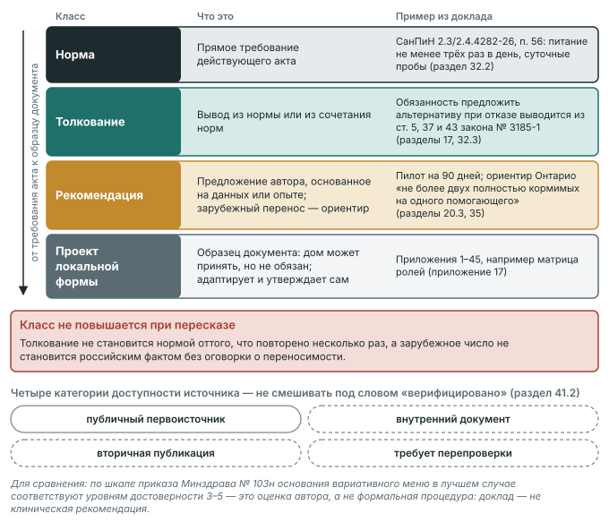
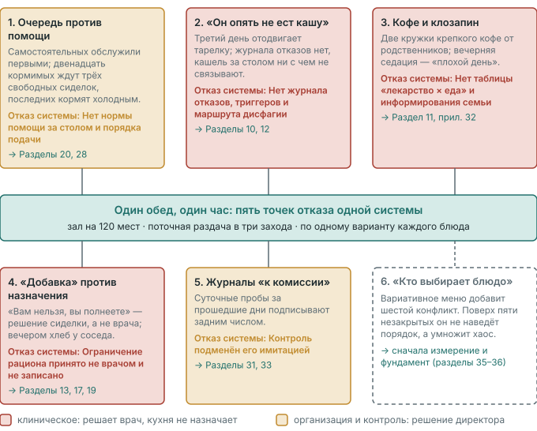
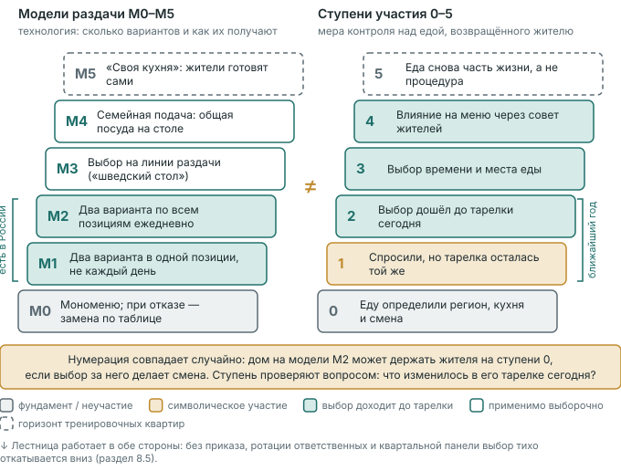
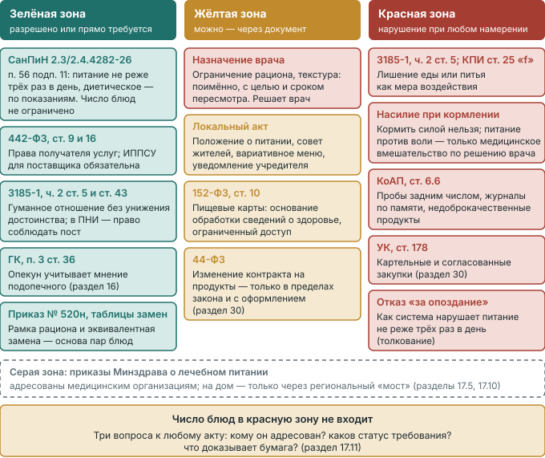
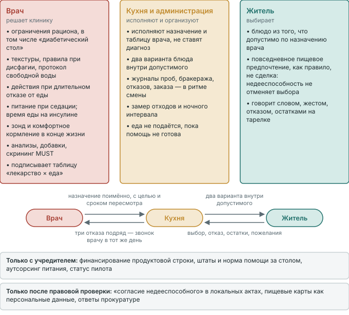
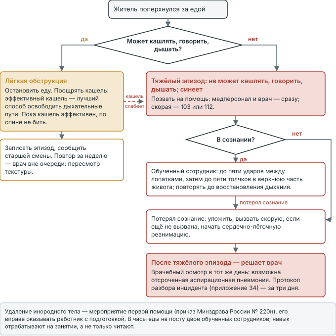
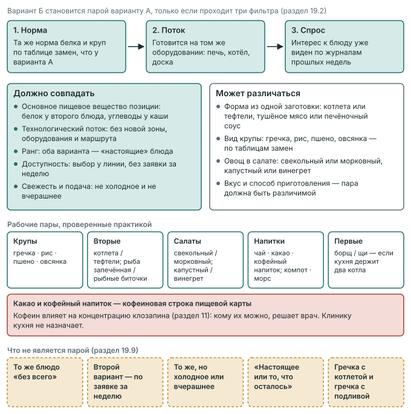
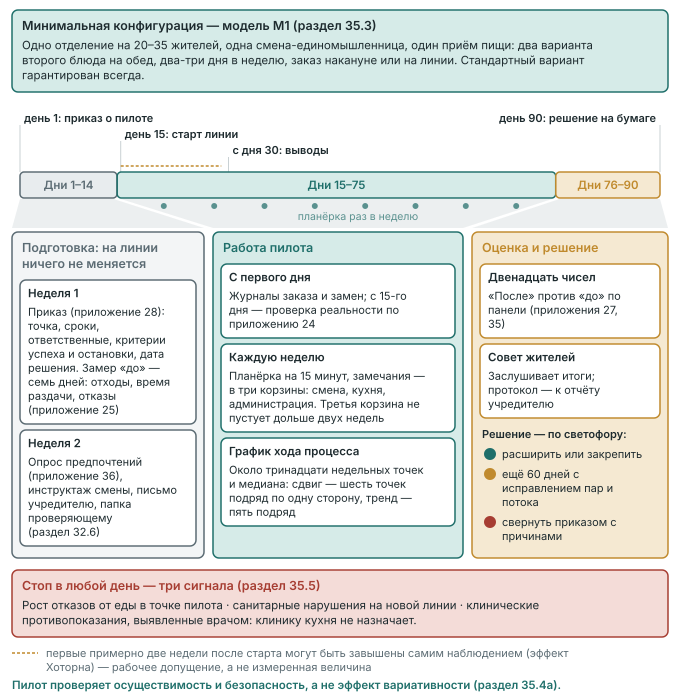
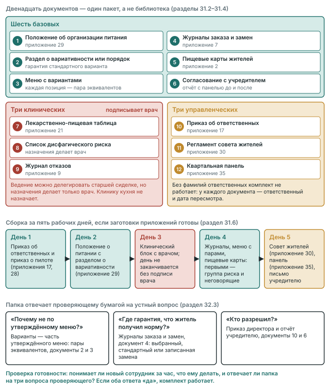
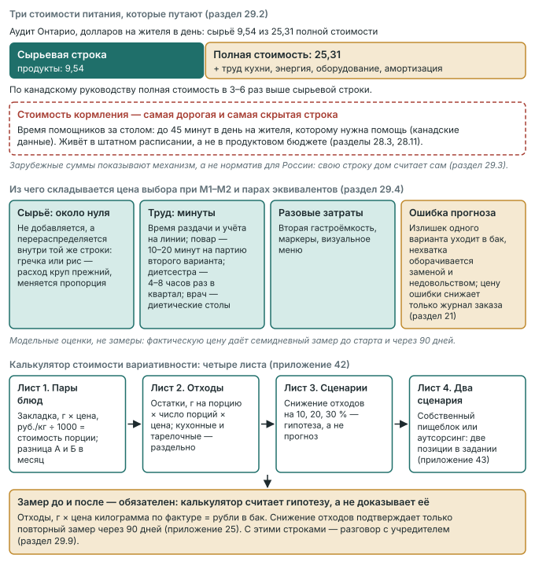

# Не просто накормить. Краткая версия для руководителя

## Как читать

Эта версия написана для директора и учредителя, у которых есть один вечер, а не неделя. Она не пересказывает полный том по главам, а отвечает на восемь вопросов в том порядке, в каком их задают на планёрке и в кабинете учредителя: зачем всё это, что представляет собой вариативное меню, что разрешено законом и чем это подтверждается, где проходит граница с клиникой, как устроен пилот на девяносто дней, какие документы нужны и что говорить проверяющему, сколько это стоит и как это измерять, что сказать учредителю и как отвечать на возражения. В конце дан список действий на первый понедельник.

Все числа, нормы и цитаты взяты из полного тома второй редакции и снабжены теми же маркерами источников в двойных фигурных скобках; расшифровка маркеров — в разделе 44 полного тома. Каждое утверждение относится к одному из четырёх классов: норма, толкование, рекомендация или проект локальной формы. При пересказе класс не повышается: толкование остаётся толкованием, зарубежное число остаётся зарубежным. Каждый раздел заканчивается отсылкой к разделам полного тома, где тема изложена полностью, с источниками и оговорками.

Если времени совсем нет, прочитайте разделы 1, 4 и 9: зачем, чего кухня не делает никогда и с чего начать в понедельник.

<figure class="fig">

<figcaption>Четыре класса утверждений: на чём стоит каждая фраза доклада и почему класс не повышается при пересказе (раздел 41)</figcaption>
</figure>

# 1. Зачем: один обед, пять конфликтов

## Обед, как он есть

Разговор о вариативном меню стоит начинать не с витрины, а с обычного обеда. Средний российский психоневрологический интернат, по расчёту аналитического проекта «Если быть точным», рассчитан на 289 мест; по тем же данным, в 2024 году в России работали 466 взрослых ПНИ, где жили 139 тысяч человек{{S004}}. Это вторичная аналитика, а не ведомственная статистика, но ясно главное: за один обед кормят больше сотни людей.

Собирательная сцена из полного тома выглядит так. Зал на сто двадцать мест, раздача в три захода, на линии по одному варианту каждого блюда. В первом заходе двенадцать жителей едят только с чужой помощью, а на смене четыре сиделки, одна из которых в это время разносит лекарства. За этот час за столом сталкиваются пять конфликтов.

Первый — **очередь против помощи**. Самостоятельных обслуживают первыми, потому что так быстрее, а тех, кого кормят, обслуживают в три цикла, и последние едят холодное. Порядок расхождения между «покормили» и «помогли поесть» показывает американское контролируемое исследование: помощь по протоколу требовала в среднем 42 минуты на человека за один приём пищи против примерно пяти минут при обычной практике, и именно протокольная помощь удерживала массу тела у жителей с риском похудения{{M-feedassist_simmons}}. Это американские дома ухода, и норматива для России из этих минут не выводится; но разница в разы покрывается скоростью, а скорость за столом — главный механизм вреда.

Второй — **«он опять не ест кашу»**. Житель третий день отодвигает тарелку, журнала отказов нет, и врач узнает о происходящем на обходе в четверг. За отказом может стоять депрессия, а может начинающаяся дисфагия; покашливание за столом никто с ним не связывает.

Третий — **лекарства и кофе**. Житель на клозапине выпил с утра две большие кружки кофе, принесённого родственниками, и никто не предупредил семью, что кофеин повышает концентрацию препарата{{M-cloz_hagg}}.

Четвёртый — **добавка**. Житель на оланзапине за год прибавил четырнадцать килограммов и просит вторую котлету; сиделка отказывает по собственному представлению о пользе, а не по назначению врача. Антипсихотики различаются по прибавке веса в разы: по метаанализу ста рандомизированных исследований — от −0,23 до +3,01 кг за шесть недель{{M-pillinger}}. Вечером этот житель забирает хлеб у соседа, и эпизод разбирают как нарушение дисциплины, а не как самовольное ограничение рациона, с которого всё началось.

Пятый, самый опасный, — **журналы «в порядок»**. К приходу комиссии учредителя суточные пробы за прошедшие дни подписывают задним числом. Этот конфликт подменяет контроль его имитацией, а типовой состав дел по статье 6.6 КоАП против социальных учреждений — как раз отсутствие суточных проб и недоброкачественные продукты{{S012}}.

<figure class="fig">

<figcaption>Один обед — пять конфликтов: у каждого «виноватого» за спиной стоит отказ системы, и у каждого отказа есть процедура (раздел 5)</figcaption>
</figure>

## Почему это одна система, а не пять проступков

У каждого эпизода есть очевидный виновник: медлительная сиделка, капризный житель, неосведомлённая семья, несдержанный едок, нерадивый завхоз. Выговор каждому ничего не изменит: через неделю всё повторится. Перед нами пять точек отказа одной системы, в которой нет нормы помощи за столом и порядка подачи, нет журнала отказов и маршрута дисфагии, нет лекарственно-пищевой таблицы, ограничения рациона вводятся не врачом, а контроль имитируется.

> **Справка. Системный подход к ошибке.** В науке о безопасности — медицинской, авиационной, промышленной — различают индивидуальный и системный взгляд на ошибку. Первый ищет виновного; второй спрашивает, какие условия сделали ошибку вероятной и почему её ничто не остановило. Повторяющийся сбой в одном и том же месте почти всегда указывает на устройство процесса, а не на характер исполнителя. Если последних кормят холодным каждый день, проблема не в сиделке, а в порядке подачи и численности смены.

Для начала ни один из пяти конфликтов не требует денег: нужны решение директора и документы. Три из пяти упираются в кадровую нагрузку, и здесь честнее сразу назвать дефицит, чем делать вид, что его закроет приказ. Важно и другое: вариативное меню добавляет шестой конфликт — «кто выбирает блюдо». Если пять базовых конфликтов не закрыты, шестой добьёт систему, потому что выбор, наложенный на хаос, только умножает хаос. Поэтому разумный порядок действий начинается не с витрины, а с измерения и фундамента.

## Скрытая цена стола

Риски стола не только бытовые. Расстройства глотания в изученных группах пациентов, получающих антипсихотики, встречаются у 21,9–69,5 % человек{{M-dysph_prev}}, среди проживающих зарубежных домов ухода — примерно у 47 %{{M-dysph_older_doan}}. Смертность от пневмонии при тяжёлых психических расстройствах в семь раз выше популяционной{{M-mortality}}, смертность от удушья пищей при шизофрении — в двадцать раз{{M-choke_luykx}}. Ни один из этих диапазонов нельзя переносить на российские дома как готовую распространённость: исследований с валидированными инструментами в наших ДСО и ПНИ нет. Но и нижние границы говорят о массовой проблеме, а не об исключении. Организация стола входит в профилактику преждевременной смертности.

Есть и деньги. Голодный житель и оплаченное сырьё, которое уходит в бак, — не две проблемы, а одна. Национальной доли пищевых отходов в наших домах не существует; получить её можно только одним способом — семидневным замером, а не лозунгом.

Наконец, права. По данным за 2022 год, обработанным проектом «Если быть точным», порядка трёх из четырёх жителей ПНИ признаны судом недееспособными{{S004}}. В вашем доме доля может быть другой, но логика от этого не меняется: для человека, который живёт в интернате, еда — три-четыре события в день, и нередко главные события дня. Права, записанные в законе, за столом либо доходят до тарелки, либо остаются строкой.

## Как выглядит та же столовая через год

Мужчина на клозапине пьёт кофе в количестве, согласованном с врачом, и семья знает почему. Житель с дисфагией получает свою текстуру, и тарелка у него не выглядит «детской». Неговорящий житель показал на карточку и получил то, на что показал. Журналы пишутся в тот день, о котором в них сказано. Конфликты не исчезли, но каждый получил процедуру и перестал зависеть от настроения дежурной.

Подробно: разделы 2, 5, 6, 43 полного тома.

# 2. Что такое вариативное меню и где на лестнице стоит ваш дом

## Четыре понятия, которые путают

В разговорах о выборе обычно смешивают четыре разные вещи. **Цикличное меню** — повторяющийся цикл блюд: четырнадцать дней в российских раскладках, двадцать один день в Онтарио, четыре недели по немецкому стандарту{{S019}}{{I-ontario}}{{I-dge}}. Оно даёт разнообразие во времени, но не выбор: каждый день все получают одно и то же. **Замена по таблице** — эквивалентная замена продуктов в раскладке, которая десятилетиями присутствует в нормах питания{{S008}}{{S021}}; её применяет кухня по остаткам и поставкам, а не житель. **Персонализация** — индивидуальные назначения врача: текстура, ограничения, усиленное питание. И только **вариативное меню** означает, что в одной точке приёма пищи существует больше одного варианта и житель выбирает.

Полный том держит строгое определение: **в момент еды житель реально может получить не менее двух вариантов и сам влияет на то, какой из них получит**. Заказ накануне этим определением не исключается, если заказанное действительно доходит до тарелки, а резерв в каждом варианте позволяет передумавшему у линии получить то, что он выбрал сегодня.

## Лестница моделей М0–М5

Между мономеню и полным выбором лежат шесть рабочих конфигураций, каждая со своей ценой и своими рисками.

- **М0. Мономеню с учётом отказов.** Выбора нет, но отказ от блюда влечёт замену по таблице, и житель не остаётся голодным. Это фундамент, а не вариативность; американская федеральная норма требует такой альтернативы сходной питательной ценности как базового минимума{{I-cfr}}.
- **М1. Выбор из двух в одной позиции** на части приёмов пищи и в часть дней. Так начинал Болотнинский ПНИ: несколько раз в неделю, на завтрак и обед, перечень блюд определяет диетическая сестра{{S015}}. Усть-Илимский дом вводил выбор поэтапно, предварительно опросив жителей{{S017}}.
- **М2. Выбор по всем основным позициям ежедневно.** По публикациям, так работает Успенский ПНИ во всех отделениях: два вторых, два салата, два напитка{{S016}}. В Иркутской области выбор из двух первых, двух вторых и гарниров описан для одного отделения Марковского геронтологического центра с сентября 2024 года; единой региональной модели нет, четыре учреждения области работают по-разному{{S018}}.
- **М3. Выбор на линии раздачи**, близкий к «шведскому столу». Требует площади, скорости потока и санитарного контроля открытых блюд; для ПНИ применим выборочно.
- **М4. Семейная подача за столом.** Блюда ставят в общей посуде, жители накладывают сами; применяется точечно.
- **М5. «Своя кухня».** Жители готовят при поддержке персонала; для российского дома это горизонт тренировочных квартир, а не массовая модель.

Подтверждённые российские практики стоят на ступенях М1–М2{{S015}}{{S016}}{{S017}}{{S018}}. Это сообщения самих учреждений, а не независимый аудит, и полный том разбирает, что о них известно и чего мы не знаем.

<figure class="fig">

<figcaption>Лестница моделей: российские дома, публично описавшие выбор, стоят на ступенях М1–М2{{S015}}{{S016}}{{S018}}; выше — точечные решения и горизонт тренировочных квартир (раздел 8.2)</figcaption>
</figure>

> **Справка. Модель и ступень участия.** Модель (М0–М5) описывает технологию раздачи: сколько вариантов, где и как житель их получает. Ступень участия (0–5) описывает, сколько контроля над едой возвращено конкретному человеку: от «еду определили регион, кухня и смена» через «выбор дошёл до тарелки сегодня» до «еда снова стала частью жизни». Дом может работать по модели М2 и держать многих жителей на нулевой ступени, если выбор за них делает смена. Нумерация совпадает случайно; оси разные. Образ лестницы участия заимствован у Шерри Арнстайн, писавшей о гражданском участии{{I-ladder_arnstein}}: участие измеряется не тем, спросили ли человека, а тем, изменило ли его слово результат.

## Пять критериев реального выбора

Любую модель проверяют пятью критериями. **Доступность**: вариант Б существует, когда к раздаче подходит житель, а не закончился на первом отделении. **Равноценность**: варианты эквивалентны по питательной ценности, то есть подобраны по таблице замен, а не по принципу «гречка или ничего». **Информированность**: житель знает о выборе и понимает его доступным ему способом — словом, показом порций, визуальным меню. **Уважение**: выбранное подаётся, а ограничения вправе устанавливать только врач. **Учёт**: выбор записывается и влияет на завтрашние объёмы.

Австралийское исследование домов престарелых показало, насколько велик разрыв между меню на бумаге и выбором на тарелке: в наблюдаемых трапезах выбора в обед не было ни для одной группы, а группа на изменённых текстурах теряла выбор первой{{I-menu_choice_abbey}}.

## Самооценка за пятнадцать минут и тихий регресс

Самооценка почти всегда завышена. Поэтому ступень и модель определяют не по положению, а по трём вопросам о вчерашнем дне: покажите вчерашний журнал; был ли второй вариант вчера физически на линии; кто вчера выбрал не то, что принесли бы по умолчанию. Если на третий вопрос третью неделю отвечают «таких нет», выбор декоративен. Правило для обеих осей одно: **оценка — это вчерашний день, а не положение**.

Лестница работает в обе стороны, и вниз по ней движутся чаще, чем вверх. Уходит инициатор, показ меню «временно» упрощают, через квартал журнал ведётся «для проверки», и выбор снова делает кухня. Снаружи учреждение по-прежнему «внедрило» вариативность. Противоядие — опора на документ и ритм, а не на человека: приказ, ротация ответственных, квартальная панель. Практику, пережившую смену двух заведующих, можно считать устоявшейся; до этого рубежа она остаётся проектом энтузиаста.

У выбора есть и смысл за пределами столовой: на постоянном сопровождаемом проживании, по вторичной аналитике, живут не более 1,8 тысячи человек, а большинство получателей таких услуг учится самостоятельной жизни в квартирах на базе ПНИ{{S004}}. Человек, который десятилетиями не выбирал даже кашу, встречает магазин и плиту как чужой язык; выбор внутри дома тренирует этот навык. На ближайший год для большинства домов реалистичны ступени участия 1–2.

Подробно: разделы 8, 19, 25 полного тома.

# 3. Что разрешено и чем это подтверждается

## Короткий ответ

Федеральное право не запрещает вариативность и не обязывает давать выбор каждого блюда. Закон требует кормить достаточно, безопасно и с уважением; он не требует кормить одинаково. Но директору этого мало: проверяющему нужна бумага, которая разрешает выбор именно в его доме. Поэтому ответом на вопрос «а нам можно?» служит не формула «запрета нет», а комплект документов (раздел 6 этой версии).

> **Справка. Классы утверждений.** **Норма** — цитата закона или подзаконного акта с реквизитами и датой проверки; ею спорят с юристом и проверяющим. **Толкование** — системное прочтение нормы применительно к ситуации, которую сама норма прямо не регулирует; оно разумно, но может быть оспорено. **Рекомендация** — опыт конкретного учреждения или вывод исследования: «делайте так, потому что так сделали там-то», но не императив. **Проект локальной формы** — шаблон приказа, положения или журнала, который требует локальной правовой проверки. Чаще всего дому вредит одна ошибка: принять толкование за норму. Тогда либо запрещают разрешённое, либо требуют того, чего закон не требует.

## Три зоны права

Полный том раскладывает право на три зоны.

**Зелёная зона** — то, что разрешено или прямо требуется. Санитарные правила требуют организовать питание проживающих не менее трёх раз в день, в том числе диетическое (лечебное) по медицинским показаниям; с 1 сентября 2026 года это пункт 56, подпункт 11 СанПиН 2.3/2.4.4282-26, который заменил СанПиН 2.3/2.4.3590-20 без переходного периода{{S003}}. Ни одна из двух редакций не ограничивает число вариантов блюд. Закон № 442-ФЗ даёт получателю услуг право на уважительное и гуманное отношение и на участие в составлении индивидуальной программы; эта программа для получателя носит рекомендательный характер, а для поставщика обязательна{{S001}}. Закон № 3185-1 в части 2 статьи 5 гарантирует «уважительное и гуманное отношение, исключающее унижение человеческого достоинства»; статья 43 распространяет на проживающих ПНИ права из частей 2 и 4 статьи 37, включая право соблюдать религиозные каноны, в том числе пост{{S011}}. Приказ Минтруда № 520н задаёт рекомендуемые нормы питания{{S002}}, а таблицы замены в региональных нормах — действующий механизм эквивалентной замены и тем самым легальная основа пар блюд{{S008}}{{S021}}.

**Жёлтая зона** — то, что делать можно, но только через документ: назначение врача, локальный акт, основание обработки данных. Ограничение рациона, изменение текстуры, пищевые карты, совет жителей с полномочиями по меню, сама вариативность — всё это законно, когда у особенности, касающейся человека, есть автор, основание и срок. Ограничение без назначения — не диета, а произвол, пусть и доброжелательный.

**Красная зона** — нарушения независимо от намерений. Лишение еды или питья как мера воздействия нарушает часть 2 статьи 5 Закона № 3185-1{{S011}}; для всех домов ту же границу проводит статья 25, пункт «f», Конвенции о правах инвалидов, запрещающая дискриминационный отказ в пище или жидкостях{{I-crpd25f}}. Насилие при кормлении недопустимо. Суточные пробы «задним числом», журналы по памяти и недоброкачественные продукты — состав статьи 6.6 КоАП{{S012}}. Систематический отказ в питании «за опоздание» нарушает требование о питании не реже трёх раз в день — это толкование, но прямое{{S003}}. **Число блюд в красную зону не входит.**

<figure class="fig">

<figcaption>Карта норм: что разрешено прямо, что — через процедуру, что запрещено независимо от намерений; число блюд в красную зону не входит (раздел 17)</figcaption>
</figure>

## Что разрешено и чем это подтвердить

| Что делает дом | Класс утверждения | Чем подтвердить при проверке |
|---|---|---|
| Два варианта блюда внутри норм питания | Норма о нормах и заменах; вариативность — рекомендация на основе практики{{S008}}{{S015}}{{S016}} | Меню с парами эквивалентов и обоснованием равноценности, положение о питании |
| Замена блюда при отказе | В России — толкование из ч. 2 ст. 5 и ст. 43 Закона № 3185-1{{S011}} | Журнал замен с датой, альтернативой и отметкой, принял ли житель замену |
| Ограничение рациона (сахар, соль, порция) | Жёлтая зона: только по назначению | Назначение врача поимённо, с целью и сроком пересмотра |
| Изменение текстуры | Жёлтая зона: клиническая необходимость | Назначение врача, список дисфагического риска, маркировка порций |
| Пищевые карты со сведениями о здоровье | Норма: специальная категория данных, ч. 2 ст. 10 152-ФЗ{{S070}} | Основание обработки, ограниченный круг доступа; кухне — функция, а не диагноз |
| Пищевые предпочтения в индивидуальной программе | Норма: программа обязательна для поставщика{{S001}} | Запись в ИППСУ, пищевая карта |
| Пилот на одном отделении | Рекомендация | Приказ о пилоте, уведомление учредителя, журналы, панель показателей |

## Недееспособность не отменяет выбора

Сделки за недееспособного совершает опекун (статья 29 ГК РФ), но повседневное пищевое предпочтение, как правило, сделкой не является. Опекун обязан выяснять и учитывать мнение подопечного (пункт 3 статьи 36 ГК РФ). С тем, кто не говорит, работают четыре канала воли: показ (жест, взгляд, карточка), наблюдение за тем, что человек ест и что оставляет, пищевая биография и знание близких. Там, где молчит и наблюдение, остаётся стандартный вариант: выбирать, чтобы поесть, не обязательно. Позиция доклада о приоритете зафиксированной воли и о случаях, когда учреждение само является опекуном, аргументирована, но остаётся позицией и требует правовой проверки в локальном акте.

## Серая зона лечебного питания и важные различия

Приказы Минздрава о лечебном питании, в том числе приказ от 05.08.2003 № 330, адресованы медицинским организациям и на организации социального обслуживания автоматически не распространяются{{S032}}{{S033}}. В некоторых регионах есть «мост» — распоряжение, прямо связывающее соцучреждения с системой диет; пример — распоряжение 19РВ-32 Московской области, на которое опирается ДДСОЛ{{S019}}. Если моста нет, работает временная конструкция: назначения по питанию даёт врач письменно, кухня исполняет их через текстуры и исключения продуктов, а не через «номерные диеты», учредителю ежегодно направляется предложение о региональном акте.

Права жителей ПНИ и ДСО общего профиля не совпадают. Статья 43 Закона № 3185-1 распространяется на организации, предназначенные для лиц с психическими расстройствами, то есть на ПНИ; в ДСО опорой служат 442-ФЗ и Конвенция о правах инвалидов. Ссылка на Конвенцию о правах инвалидов в положении — обоснование, а не источник обязанности: формула «Конвенция требует двух вариантов каши» была бы повышением класса.

## Что доклад не знает

Репрезентативной статистики вариативного питания в российских организациях нет. Рандомизированных исследований эффекта вариативности в психиатрических стационарах не найдено, и это не особенность психиатрии: систематический обзор EDWINA по мерам поддержки питания при деменции, включивший 56 вмешательств из 51 исследования, не нашёл окончательных доказательств эффективности конкретных мер{{M-dementia_edwina}}. Судебной практики о вариативном меню не обнаружено, статус норм в каждом регионе индивидуально не проверен, а нормы и учётные формы меняются, поэтому перед изданием приказа их сверяют заново. Пробелы — не слабость, а карта мест, где читатель включает собственную проверку.

Подробно: разделы 16, 17, 18, 24, 41 полного тома.

# 4. Граница с клиникой: что кухня не назначает

## Граница, которую произносят первой

Эту границу нужно назвать раньше любого перечня взаимодействий, иначе предложение о вариативном питании будет услышано как медицинская реформа руками повара.

**Только с врачом:** любые ограничения рациона, включая «диабетический стол»; изменение текстур; правила при дисфагии и протокол свободной воды; действия при длительном отказе от еды; режим питания при седации; решения о зондовом питании и о комфортном кормлении в конце жизни; сдвиг времени еды у жителей на инсулине; слабительные и реакция на запор; анализы и добавки микронутриентов; интерпретация скрининга недостаточности питания.

**Только с учредителем:** изменение продуктовой строки финансирования; изменение штатного расписания, в том числе нормы помощи за столом; аутсорсинг питания; официальный статус пилота и его публичность.

**Только после правовой проверки:** формулировки о «согласии недееспособного» в локальных актах; обработка пищевых карт как персональных данных; ответы на запросы прокуратуры; конструкции, в которых учреждение одновременно выступает опекуном жителя.

<figure class="fig">

<figcaption>Граница ответственности: кухня исполняет назначение, а не ставит диагноз; клиника — у врача, ресурсы — у учредителя (раздел 4.0)</figcaption>
</figure>

## Дисфагия: невидимая угроза

> **Справка. Дисфагия и аспирация.** Дисфагией называют любое затруднение при продвижении пищи или жидкости изо рта в желудок. В домах социального обслуживания преобладает ротоглоточная дисфагия, когда нарушен сам акт глотания. Её главная опасность — аспирация, то есть попадание пищи, жидкости или слюны в дыхательные пути. Аспирация бывает «немой»: человек не кашляет, и приём пищи внешне выглядит благополучным. Отсутствие кашля ещё не говорит о безопасности.

Механизмы дисфагии в наших домах действуют одновременно: побочные эффекты и седация от антипсихотиков, сама болезнь, торопливая еда, возраст, неврологические болезни, плохие зубы и протезы. Риск удушья повышают именно сильные антагонисты дофаминовых рецепторов в высоких дозах{{M-choke_luykx}}; выбор препарата — решение врача, но дом должен знать, что смена схемы лечения меняет и риск за столом.

Распознавание начинается не со специалиста, а с обученного наблюдателя. Тревожные признаки видит и сиделка без логопеда: кашель и поперхивание во время еды и после неё, «влажный» голос после глотка, многократное проглатывание одного куска, еда за щекой, необычно долгий приём пищи, отказ от твёрдого при сохранном аппетите, повторные пневмонии. Любой признак — повод записать наблюдение и сообщить врачу.

Дом без логопеда может своими силами выстроить организационный минимум из семи элементов: список риска на посту и на кухне; назначенные врачом поимённо текстуры с датой пересмотра; вертикальная поза, малые порции и тридцать минут сидя после еды; приём таблеток по тем же правилам; осторожность с хлебом, сухими продуктами, крупными кусками и блюдами смешанной консистенции; алгоритм удушья и двое обученных сотрудников на посту в часы еды; передача сведений о риске при каждом переводе и госпитализации. Этот пакет не лечит и не заменяет врача; он переводит дом из состояния «не знаем, кто в группе риска» в состояние «знаем, наблюдаем, исполняем назначения».

> **Справка. IDDSI.** Международная инициатива по стандартизации диет при дисфагии описывает восемь уровней консистенции: для напитков 0–4, для пищи 3–7; существует официальный русский перевод терминов. Каждую консистенцию можно проверить подручными средствами: напиток — тестом на текучесть из шприца, пищу — надавливанием вилкой и наклоном ложки. IDDSI — язык и метод проверки, а не диагностика: уровень назначает медицинский специалист.

Общий язык текстур даёт измеримый результат. В исследовании пяти учреждений доля поданных текстур, совпадающих с назначенными, выросла после внедрения IDDSI с 44 до 90 %, для загущённых жидкостей — с 31 до 100 %, и главным барьером оказалась осведомлённость персонала, а не оборудование{{M-iddsi_wu}}. Решающее вложение — обучение, а не закупка техники.

Дисфагия не отменяет выбор: она переносит его внутрь текстуры. Вместо одного протёртого второго жителю предлагают два варианта той же консистенции. Без этого группа с дисфагией теряет одновременно и здоровье, и голос.

<figure class="fig">

<figcaption>От признака за столом к врачебному решению: что видит сиделка, что делает пост и что решает только врач (раздел 10){{M-choke_luykx}}</figcaption>
</figure>

## Четыре лекарственно-пищевых правила

Взаимодействий «препарат — пища» десятки, но столу нужен не справочник, а короткий перечень с действиями для кухни и поста. Четыре правила кухня исполняет по таблице врача{{M-cloz_hagg}}{{M-lithium}}{{M-maoi_nhs}}{{M-carb_gf}}.

**Клозапин и кофеин.** Кофеин тормозит разрушение клозапина: в контролируемом исследовании добавка 400–1000 мг кофеина в сутки повышала площадь под фармакокинетической кривой в среднем на 19 %{{M-cloz_hagg}}, а резкая отмена привычного кофеина снижает концентрацию на 37–47 %{{M-cloz_wd}}. Курение ускоряет разрушение препарата, поэтому вынужденный отказ от курения при поступлении или болезни тоже повод сообщить врачу. Кофе не служит ни наградой, ни наказанием; резкие изменения привычки без врача не допускаются.

**Литий, соль и вода.** Литий выводится почками тем же путём, что и натрий: резкое уменьшение соли или обезвоживание повышают его концентрацию, резкое увеличение соли ослабляет лечение{{M-lithium}}. Кухня не вводит «малосольный стол» без врача, вода стоит на виду, о рвоте, поносе, лихорадке у жителя на литии врач узнаёт в тот же день.

**Ингибиторы МАО и тирамин.** При приёме неселективных ингибиторов МАО тирамин из выдержанных сыров, копчёностей, солений вызывает гипертонический криз{{M-maoi_nhs}}. Жёсткость тираминовой разметки для конкретного препарата определяет врач; выбор строится внутри безопасного множества.

**Грейпфрут.** Грейпфрут тормозит фермент, разрушающий карбамазепин и ряд других препаратов, и повышает их концентрацию; для карбамазепина — порядка 40 %{{M-carb_gf}}. Решение простое: грейпфрута и его сока нет ни в закупке, ни в меню, «подарочные» соки в передачах проверяет дежурный.

Таблица «лекарство × еда» на посту законна только с подписью врача и пересматривается при каждой смене терапии. На кухню и в комнату передач уходит не диагноз и не название препарата, а результат: «без грейпфрута», «кофе — не больше привычного». Регламент передач пишется как разрешение с перечнем недопустимого, а не как полный запрет: полный запрет порождает подполье, и кофе всё равно попадает к жителю, но уже без учёта.

## Отказ от еды: алгоритм вместо интуиции

За одним и тем же «не буду» может стоять невкусное блюдо, депрессия, бред отравления, дисфагия, зубная боль или угасание в конце жизни. Цена ошибки несимметрична: пропущенный «каприз» стоит тарелки, пропущенная дисфагия или депрессия может стоить жизни. Главная ошибка — смешение причин: осознанный отказ лечат как симптом, а симптом списывают на характер. Первое унижает человека, второе может его убить.

Полный том предлагает **проект российского правила**, построенный по образцу канадского регулирования{{I-ontario}}; это не российская норма, и в локальном акте он должен быть так и обозначен. Каждый отказ записывается и влечёт альтернативу в тот же приём. **Три отказа подряд — врач в тот же день**, а не на обходе в четверг. Если человек неделю системно оставляет четверть порции и больше — врач и пересмотр карты в течение двух дней. Отказ от воды или одновременно от еды и воды — немедленно. Эпизод закрывается записью о том, что установлено и когда пересмотр.

Граница для смены не допускает толкований: жителю **предлагают, заменяют, адаптируют, фиксируют, эскалируют — силой не вводят**. Искусственное питание — медицинское вмешательство, решение о котором принимает врач в порядке, установленном законом. В корпусе есть расхождение о том, запрещено ли принудительное кормление прямой нормой или запрет выводится из права на достоинство; для смены разницы нет — сила исключена.

## Вес, ночь и помощь за столом

Ограничение порции «потому что полнеет» без назначения врача — самовольное ограничение рациона; работа с весом идёт через врача. Ночной интервал между ужином и завтраком — операционная цель дома не больше тринадцати часов; это рабочий ориентир авторов внутри международного диапазона 11–14 часов, а не нормативное требование. Если интервал больше, сдвигают расписание или по согласованию с врачом вводят вечерний перекус. Наконец, помощь за столом: международная норма Онтарио допускает не более двух полностью кормимых жителей на одного работника и требует подавать еду, только когда помощь готова{{I-ontario}}. В России такой нормы нет, а рекомендуемые нормативы приказа Минтруда № 305н дают одну должность помощника по уходу на 12 получателей в смену для самых зависимых групп{{S100}}. Ни одна российская норма не описывает час еды отдельно, и значит, этот час дом организует сам: все свободные руки на время еды, рассадка по степени помощи, подача под готовые руки, а дефицит — числом и письменно учредителю.

Подробно: разделы 4.0, 9, 10, 11, 12, 13, 20, 28 полного тома.

# 5. Пилот на девяносто дней

## Почему пилот и почему девяносто дней

Призыв «меняйте всё с понедельника» ломает сразу две вещи: кухню, которая работает как поток с жёстким ритмом, и самих жителей, для которых предсказуемость среды — часть благополучия. Пилот бережёт и то и другое: меняется одна точка, всё остальное идёт как вчера.

> **Справка. Пилот осуществимости.** В методологии различают исследование осуществимости, которое отвечает на вопрос «можно ли это сделать в наших условиях и какой ценой», и исследование эффективности, которое отвечает на вопрос «приносит ли это пользу». Первому не нужны контрольная группа и большая выборка, второму нужны. Теория внедрения называет результаты первого типа исходами внедрения: приемлемость, принятие, уместность, осуществимость, точность исполнения, стоимость, охват и устойчивость{{M-impl_outcomes_proctor}}. Вмешательство может не сработать потому, что оно неэффективно, а может — потому, что хорошее вмешательство исполнено неправильно; первое называют провалом вмешательства, второе — провалом внедрения.

За девяносто дней проявляются три вещи: устойчивая статистика выбора, когда схлынул эффект новизны; реальные трудовые издержки, когда смена перестаёт работать «на подъёме»; первые конфликты, без которых не бывает ни одной перемены. Российский опыт подтверждает логику постепенности: Усть-Илимская организация шла от опроса предпочтений к расширению практики{{S017}}, а Успенский ПНИ зафиксировал, что страхи персонала не подтвердились, — но сделал этот вывод после пробного периода, а не до него{{S016}}.

## Точка пилота

Одно отделение на 20–35 жителей, одна смена-единомышленница, один приём пищи. Меньше — это проба, больше — реформа без подстраховки. При выборе отделения «сложный» контингент — группа помощи, неговорящие жители — предпочтительнее удобного: практика, прошедшая сложное отделение, масштабируется почти сама, а прошедшая только удобное ломается о первое сложное и хоронит тему для всего дома.

## Технология двух вариантов без второй кухни

Модель М1 требует не второй кухни, а второго варианта ключевого блюда в том же технологическом потоке: каши А и Б варятся одновременно в двух котлах, вторые блюда А и Б готовятся из одной мясной заготовки двумя способами. Вариант Б проходит три фильтра: норма (та же норма белка или круп по таблице замен), поток (то же оборудование), спрос (интерес, видный по журналам). Рабочие пары просты: гречка, рис, пшено, овсянка; котлета или тефтели; рыба запечённая или рыбные биточки; свекольный или морковный салат. Пара должна быть различимой и одного «ранга»: «рыба или остатки вчерашнего» сортирует жителей по сортам, и они считывают это сразу.

Объёмы планируются по обычной тетради. Вчерашний выбор задаёт сегодняшнюю варку; пока статистики нет, готовят пятьдесят на пятьдесят с резервом; раз в две недели доля выбравших вариант Б корректирует закупку. Главный индикатор сбоя — доля тех, кто выбрал вариант Б и не получил его; она должна стремиться к нулю, а если растёт, виноваты объёмы, а не «непредсказуемые жители». Журнал замен — недооценённый документ: только он доказывает, что отказ обернулся альтернативой, а не голодом.

<figure class="fig">

<figcaption>Два варианта без второй кухни: одна заготовка, две формы, две гастроёмкости с пробами и журнал, который замыкает цикл планирования (раздел 19)</figcaption>
</figure>

## Три этапа

**Дни 1–14: подготовка без изменений на линии.** В первую неделю подписывается приказ о пилоте: точка, сроки, ответственные, критерии успеха и остановки, дата решения по итогам. Одновременно начинается замер «до»: семь дней учёта отходов, времени раздачи и отказов. Семь дней, а не один, потому что единичный «показательный» день почти всегда нетипичен. Во вторую неделю в точке пилота проводится опрос предпочтений, ответы заносятся в пищевые карты, смена раздачи проходит инструктаж, учредитель получает письмо, а папка для проверяющего собирается до старта.

**Дни 15–75: работа.** Минимальная конфигурация — два варианта второго блюда на обед, два-три дня в неделю, заказ вечером накануне или прямо на линии. **Стандартный вариант гарантирован всегда**, даже если житель ничего не выбрал. Журналы заказа и замен ведутся с первого дня. Раз в неделю — пятнадцатиминутная планёрка, где замечания раскладываются по трём корзинам: смена (очередь, маркировка), кухня (пары, объёмы), администрация (документы, закупка). Третья корзина не должна пустовать дольше двух недель: если администрация ничего не делает, смена видит, что её усилия никому не нужны, и пилот выдыхается.

**Дни 76–90: оценка и решение.** Двенадцать показателей панели сравниваются «после» и «до», и ни одно число не показывают без фразы «что это значит». Совет жителей заслушивает итоги, протокол прикладывается к отчёту учредителю. Решение директора — одно из трёх, на бумаге: расширение, закрепление точки или свёртывание с причинами.

## Первая неделя работы линии по дням

| День | Что происходит | На что смотреть |
|---|---|---|
| День 1 | Накануне вечером объявлено меню и собран заказ; утром до варки сверены объёмы; на линии старшая смены | Вечером — десятиминутный разбор |
| Дни 2–3 | Обычные сбои: очередь у варианта Б, забытые бирки, «стандартные» порции без вопроса | Каждый сбой исправляется вечером того же дня |
| Дни 4–5 | Учёт срывов и замен | Проверка реальности выбора: пять вопросов приложения 24 |
| Выходные | Линия может не работать в режиме выбора | Журнал не молчит: записывается, что выдано |
| День 7 | Планёрка | Замечания по трём корзинам: смена, кухня, администрация |

До того как накопятся семь дней данных, ничего не отменяется и не «улучшается»: первая неделя — базовая линия новой схемы, а не её эффект.

<figure class="fig">

<figcaption>Пилот на девяносто дней: две недели подготовки без изменений на линии, два месяца работы, две недели оценки и одно письменное решение (раздел 35)</figcaption>
</figure>

## Как читать числа пилота

Еженедельные числа удобнее смотреть не в таблице, а на графике хода процесса: по горизонтали недели или дни, по вертикали показатель, посередине линия медианы. Простые правила чтения таковы: сдвиг — шесть и более последовательных точек выше или ниже медианы; тренд — пять и более точек подряд, которые все растут или все снижаются; сам график лучше всего работает, когда в нём не меньше десяти точек{{I-cec_runchart}}. За девяносто дней недельных точек набирается около тринадцати.

> **Справка. Почему график лучше двух чисел.** Сравнение среднего «до» и среднего «после» скрывает время: оно не показывает, произошло ли изменение сразу после старта, постепенно или случайно в одну неделю. График хода процесса позволяет отличить настоящий сдвиг от обычного разброса без сложной математики. Это не статистическое доказательство эффекта, а способ не обмануться случайным колебанием.

Смещения нужно назвать вслух, иначе их назовут за вас. **Эффект Хоторна**: люди, знающие, что за ними наблюдают, ведут себя иначе; систематический обзор подтверждает, что такие эффекты существуют, но об их величине и длительности мало что известно достоверно{{M-hawthorne_mccambridge}}. Поэтому допущение, что две недели после старта завышены самим экспериментом, — рабочее правило, а не измеренная величина: база фиксируется до старта, выводы делаются по дням 30–90. Летние отходы нельзя переносить на зиму; при смене состава смены вы измеряете смену, а не вариативность; после особенно плохой недели следующая окажется лучше сама по себе — это возврат к среднему, и защита от него — семидневная база.

## Что пилот доказывает и что нет

Пилот проверяет исполнимость и безопасность, а не эффект вариативности. Сравнение «до» и «после» на одном отделении без контрольной группы показывает, держатся ли два варианта в ритме смены, ведутся ли журналы, не выросли ли отказы и эпизоды аспирации и какова цена сырья, труда и отходов. Оно не показывает, что именно выбор улучшил отходы, вес или настроение: контролируемых исследований эффекта вариативного меню в психиатрии не опубликовано.

Решение удобно заранее записать в формате светофора, который методологи пилотных исследований считают предпочтительнее простого «стоп — продолжать»{{M-pilot_progression_avery}}; из их работы переносится только формат, а не пороги. **Зелёный**: журналы ведутся без срывов, выбор есть на большинстве приёмов, отказы и клинический риск не выросли, трудозатраты укладываются в смету — «умеем безопасно», расширение или закрепление, но не «выбор доказал пользу». **Жёлтый**: исправимые проблемы с парами, потоком, очередью, маркировкой — ещё шестьдесят дней с исправлениями. **Красный**: рост отказов или аспираций либо неподъёмные трудозатраты — свёртывание приказом с причинами.

Немедленная остановка наступает при любом из трёх сигналов: рост отказов от еды в точке пилота, санитарные нарушения на новой линии, клинические противопоказания, выявленные врачом. Всё остальное — рабочие проблемы: очередь решается организацией потока, страхи персонала — инструктажем, жалобы «выбирают не то» — пересмотром пар.

## Четыре исхода, которые надо знать заранее

**Тихая смерть**: к шестидесятому дню журналы перестают вестись, потому что у ритма нет владельца. **Бунт кухни**: второй вариант невыполним из-за загрузки плит, потому что пилот проектировали без заведующего производством. **Фиктивное оживление**: журналы заполнены, а жители молчат, потому что журналы предзаполняют. **Честное свёртывание**: отказы выросли или трудозатраты неподъёмны, и пилот свёрнут приказом. Из четырёх исходов только последний — успех управления: система узнала о себе правду и не заплатила за это здоровьем жителей.

Насколько типичны первые три, показывает британское исследование домов ухода: из семи внедрённых вмешательств через несколько лет продолжались лишь три, а устойчивость зависела от мониторинга результатов, преемственности кадров и видимой пользы{{M-qi_sustain_devi}}. Долю «выживших» на российские дома не переносят, но перечень факторов узнаваем.

## После пилота и если кухня чужая

Пилот — первый квартал годовой карты, где каждый квартал ценен сам по себе: фундамент и пилот; расширение на все приёмы или соседнее отделение и запуск совета жителей; закупки под парные позиции и первый квартальный отчёт учредителю; решение о всём доме по данным трёх кварталов и публичный рассказ.

Если питание поставляет внешний исполнитель, пилот начинается не с кастрюли, а со спецификации. Вариативность на аутсорсинге — это восемь строк контракта: перечень как группы взаимозаменяемых позиций, пропорции по статистике выбора, строка выбора, строка замен, строка качества для текстур, строка приёмки, строка состава, строка отчётности. Исполнение передаётся подрядчику, ответственность — нет: контроль проб, бракераж при приёмке, текстуры и эскалация отказа остаются за домом. Публичных кейсов вариативности на аутсорсинге нет; это пробел в знаниях, а не доказательство невозможности.

Подробно: разделы 19, 20, 21, 35, 36, 42 полного тома.

# 6. Документы, проверяющий и ответственность директора

## Двенадцать документов — один пакет

Практика, которая держится на людях, уходит вместе с ними. Комплект документов закрепляет границы, распределяет ответственность по фамилиям и делает практику воспроизводимой. Все шаблоны приложений полного тома — проекты локальных форм, а не нормативы и не «рекомендованные министерством образцы».

**Шесть базовых документов.** Положение об организации питания со ссылкой на закон № 3185-1, санитарные правила, нормы питания и обязательно на региональный акт, которым по новым Правилам организации деятельности устанавливаются нормы питания в организациях субъекта{{S100}}. Раздел о вариативности с перечнем позиций, механизмом заказа, гарантией стандартного варианта — «никто не остаётся без полноценного приёма пищи» — и правилом замен; он может жить и в правилах внутреннего распорядка, как в Серафимовском{{S035}}, важно лишь, чтобы он был утверждён. Меню с вариантами, где каждая вариативная позиция — пара эквивалентов с обоснованием. Журналы заказа и замен. Пищевые карты жителей. Согласование с учредителем.

**Три клинических документа.** Лекарственно-пищевая таблица, подписанная врачом. Список дисфагического риска с назначенными текстурами. Журнал отказов с правилом трёх отказов.

**Три управленческих документа.** Приказ об ответственных — без фамилий комплект не работает. Регламент совета жителей по питанию. Квартальная панель показателей.

<figure class="fig">

<figcaption>Документальный комплект: шесть базовых, три клинических и три управленческих документа, которые собираются за пять рабочих дней (раздел 31)</figcaption>
</figure>

Если заготовки приложений готовы, комплект собирается за пять рабочих дней. День первый — приказы об ответственных и о пилоте. День второй — положение о питании с разделом о вариативности. День третий — клинический блок с врачом, и этот день не заканчивается без его подписи. День четвёртый — журналы, меню с парами и пищевые карты первой очереди: группа риска и неговорящие жители. День пятый — регламент совета, панель, письмо учредителю. Проверка готовности — два вопроса: понимает ли новый сотрудник за час, что ему делать, и отвечает ли папка на три вопроса проверяющего.

Обратная опасность — раздувание. Каждая графа должна отвечать на вопрос «какое решение принимается по этой графе?»; графа, по которой решений не принимают, удаляется. У каждого документа есть и дата пересмотра: таблица врача — при каждой смене назначений, список риска — ежемесячно, положение — раз в год. Документ, который в живой системе год не менялся, либо мёртв, либо мертва сама система.

## Кто приходит и о чём спрашивает

**Роспотребнадзор** проверяет санитарию: температуру, маркировку, суточные пробы, поточность. Вопроса «почему у вас два варианта» санитарный инспектор не задаёт, потому что ни одна редакция правил не ограничивает число блюд; отсюда правило — у каждой второй гастроёмкости своя проба, своя строка в журнале и своя маркировка. **Контроль в сфере социального обслуживания и учредитель** смотрят на исполнение стандартов и нормативов, расходование средств, жалобы. **Прокуратура** приходит, как правило, по жалобе и спрашивает о правах жителей; журнал отказов и документированный выбор служат здесь ответом, а не уязвимостью.

## Три вопроса и три ответа

**«Почему не по утверждённому меню?»** Варианты — часть утверждённого меню, а не отступление от него: пары нутриентно равноценны, перечень согласован. Здесь же проходит красная линия: если региональное меню императивно и исключает замены вне утверждённой таблицы, сначала меняется региональный документ, затем практика. Раздавать два варианта при императивном меню без изменения документа — нарушение, и полный том этого не советует.

**«Где гарантия, что житель получил норму?»** Журнал заказа и журнал замен: по ним видно, что каждый получил выбранный вариант, стандартный или зафиксированную замену. В России обязанность предложить альтернативу при отказе прямо не записана и выводится толкованием из права на достоинство{{S011}}; журнал превращает это толкование в доказательство факта.

**«Кто разрешил?»** Приказ директора и отчёт учредителю. Учреждения, внедрившие выбор публично, шли именно этим путём.

На устный вопрос отвечают бумагой. Поэтому папка «Питание: проверки» собирается до старта пилота и хранится у заместителя, а не в сейфе: если её нельзя достать за минуту, её всё равно что нет. В ней десять разделов — приказы, положение, меню с парами, журналы за квартал, санитарный блок, клинический блок с подписью врача, панель, переписка с учредителем, протоколы совета жителей, последний акт проверки с отметками об устранении. Прошлогодние журналы хуже отсутствия папки: они показывают, что практика когда-то была, а теперь не ведётся.

## Чего не говорить и как вести себя при проверке

Три фразы в коридоре звучат убедительно, а в акте становятся уликами. «Так теперь везде» — неправда и не аргумент. «Нам диетолог разрешил» — такой должности может не оказаться в штате, а клинические решения подписывает врач. «Жители сами захотели» без документа — непроверяемо; та же фраза со ссылкой на протокол совета становится доказательством.

При самой проверке достаточно пяти правил: отвечать на заданный вопрос; подтверждать факты документом; не спорить в коридоре, а излагать несогласие письменно; вести собственную запись хода проверки; не подписывать акт с непонятными формулировками без оговорки «с формулировкой не согласен, возражения будут представлены». Право сообщить контрольному органу о несогласии с результатами закреплено статьёй 36 закона № 248-ФЗ{{S110}}.

Если замечание всё же выписано, действуют по порядку: точно фиксируют формулировку, запрашивают норму, подключают учредителя на стадии возражения, помнят о сроках. Жалоба на решение или действие контрольного органа подаётся через Единый портал в течение тридцати календарных дней, на предписание — в течение десяти рабочих дней; рассматривается она пятнадцать рабочих дней{{S110}}. На представление прокурора меры принимаются и сообщаются письменно в течение месяца{{S111}}. Сроки указаны на дату проверки текста и перед подачей сверяются с действующей редакцией.

## Ответственность: карта без запугивания

Публичные дела по статье 6.6 КоАП в учреждениях социального обслуживания известны, и все они касаются качества и достаточности питания, а не вариативности{{S012}}. Санкция для должностных лиц — штраф от пяти до десяти тысяч рублей, для юридических — от тридцати до пятидесяти тысяч или приостановление деятельности до девяноста суток{{S112}}. Единственное найденное судебное толкование о применимости этой статьи вне общепита касается школы, а не дома-интерната: Верховный Суд переквалифицировал дело на статью 6.7, указав, что учреждение не является специализированной организацией, реализующей населению услуги питания{{S022}}. Перенос этой логики на ДСО и ПНИ — аналогия и толкование, а не прямая позиция суда.

Уголовные составы формально применимы к руководителю, но требуют вины и последствий{{S113}}; публичных уголовных дел против директоров ПНИ по организации питания не обнаружено. Запугивание ими — недостоверная риторика, игнорирование административного контура — легкомыслие. А «дел о двух вариантах не найдено» означает не «низкий риск», а непроверенную зону.

Главное: **вариативность не добавляет новых составов**, а перераспределяет жалобу: «невкусно» превращается в «я выбрал сам», но только если выбор задокументирован. Без документов два варианта читаются как отступление от меню, замена без записи — как «не докормили». Директор отвечает за систему контроля, а не за каждое событие за столом{{S012}}{{S022}}. Личный риск снижают четыре вещи: коллегиальность решения (приказ, протокол совета, уведомление учредителя), подпись врача под каждым клиническим документом, скорость разбора жалоб — в дни, а не в недели, и честность статусов: документ, названный проектом локальной формы, не даёт повода для претензии в самоуправстве. Риск определяется качеством следа, а не смелостью изменений.

## Совет жителей

Совет жителей — организационная форма, в которой права становятся ежемесячной процедурой. Федеральной нормы о нём нет, он создаётся локальным актом; попечительский совет, состоящий из внешних лиц, его не заменяет, потому что в нём нет тех, кто ест. Работающий совет — пять–девять человек с квотами по отделениям, четыре полномочия (обсуждать меню до утверждения, проводить дегустации, собирать пожелания, получать ответ в срок) и ежемесячный протокол, который становится доказательством для проверяющего. Недееспособные жители участвуют через доверенных лиц и наблюдательные методы. Декоративный совет хуже отсутствующего: он производит цинизм.

Подробно: разделы 31, 32, 33, 34 полного тома.

# 7. Сколько это стоит и как это измерять

## Честная рамка

Формула «вариативность почти бесплатна» из прежних версий удалена как недоказанная. Источники расходятся: одни пишут, что выбор реализуем без существенного роста затрат, другие — что вариативное меню объективно дороже единого из-за запаса, планирования и отходов при ошибках прогноза. Обе позиции имеют основания. Позиция доклада: модели М1–М2 при парах эквивалентов не требуют новых денег на сырьё, но требуют труда, планирования и точного учёта выбора, без которых действительно становятся дороже. И есть прямое свидетельство обратного «бесплатности»: старт в Серафимовском потребовал оборудования и дополнительных ставок{{S030}}. Пилот модели М1 в одном отделении обычно укладывается в текущую смету; «без новой сметы» не значит «без затрат».

## Три стоимости, которые путают

> **Справка. Сырьевая строка и полная стоимость.** Сырьевой строкой в докладе называют стоимость продуктов на жителя в день; в зарубежной литературе это raw food cost. Полная стоимость питания включает также труд кухни, энергию, оборудование и амортизацию. В российских сметах полную стоимость отдельной строкой обычно не выделяют, а ближайший аналог сырьевой строки — стоимость набора продуктов по нормам, которые устанавливаются региональными актами{{S100}}.

**Сырьевая строка** — продукты на жителя в день. **Полная стоимость приёма пищи** — сырьё плюс труд, энергия и амортизация; по канадскому руководству она в три–шесть раз выше сырьевой строки{{I-dcbp}}, а аудит Онтарио при сырье 9,54 доллара оценил совокупные расходы на питание в 25,31 доллара на жителя в день{{I-onaudit2019}}. **Стоимость кормления** — время помощников за столом, самая дорогая и самая скрытая строка, которая живёт в штатном расписании, а не в продуктовом бюджете. Отсюда главный экономический вывод: сокращение сырьевой строки — самая заметная и самая вредная экономия. Она бьёт прямо по жителям, экономит меньшую долю расходов и порождает скрытые издержки — потерю веса, болезни, жалобы, проверки. Эффективность разумно искать в большой доле: потоке раздачи, трудозатратах, отходах.

<figure class="fig">

<figcaption>Три стоимости, которые путают: сырьё — меньшая часть полной стоимости питания, а помощь за столом — самая дорогая и самая скрытая строка (раздел 29){{I-dcbp}}{{I-onaudit2019}}</figcaption>
</figure>

## Как посчитать свою строку за час

Расходы на продукты за последний полный месяц делятся на число жителей и на число дней. Считают только продукты, без труда и коммунальных платежей; сравнивают себя с собой в динамике и с региональными коллегами, а не с зарубежными долларами; публикуют — учредителю и совету жителей. Во всех изученных странах перемены начинались с публикации сырьевой строки, и видимую строку сократить труднее, чем невидимую{{I-fct}}. Если никто в доме не может назвать эту цифру за пять минут, это первая находка аудита.

## Цена труда: минуты, а не страхи

Главный страх смены — «это добавит час на каждую раздачу». Иллюстративная раскладка полного тома для обеда на отделении из тридцати жителей в модели М1 даёт около **плюс двадцати четырёх человеко-минут** на обед: показ меню, сбор заказа, пересчёт объёмов, маркировка второй гастроёмкости, раздача с предложением выбора, записи в журналы. При выборе в один приём два-три дня в неделю это порядка 50–70 человеко-минут в неделю на отделение. Оценка экспертная, опирается на канадские аналоги{{I-dcbp}}, и собственный замер обязателен. Её либо укладывают в пересменку, либо обосновывают ею заявку на ставку. Фраза «не справимся, потому что страшно» без цифры — не управление.

## Отходы: единственная честная «экономия»

Несъеденная порция — оплаченное сырьё в баке. Выбор может снижать долю несъеденного, но доказательной базы такого эффекта в наших условиях нет. Ориентиры есть только в больницах, и переносятся они лишь как гипотеза. В обзоре 32 больничных исследований медиана отходов с тарелки составила 30 % по массе при разбросе от 6 до 65 %, а среди причин названы, в частности, неподходящие порции и ограниченный выбор{{M-platewaste_williams}}. В австралийской больнице переход к модели, при которой пациент сам заказывает блюдо, сопровождался снижением отходов с 30 до 17 % и годовых затрат на продукты на 28 %{{M-room_service_mccray}}; это ретроспективное сравнение в одной больнице, а больничный пациент и житель ПНИ — разные люди. Обещать учредителю экономию на основании зарубежных больничных данных нельзя.

Порядок действий прост: три блюда с наибольшими остатками убирают, уменьшают или заменяют парой, а массу недельных отходов умножают на цену килограмма по фактуре. Тарелочные остатки говорят о вкусе и порции, кухонные — о планировании, и смешивать их нельзя. Снижение отходов после введения выбора подтверждает только повторный замер через девяносто дней.

## Измеряй факт, а не документ

Аудиторы Онтарио, побывавшие в часы еды в пятидесяти четырёх домах, увидели ожидание помощи и недоеденные тарелки, которых документы не показывали{{I-onaudit2019}}: если питание не измеряется, разрыв между бумагой и тарелкой остаётся невидимым. Полный том предлагает три инструмента разной глубины.

**Экспресс-аудит «Стол за один день»** — двадцать четыре строки в четырёх блоках: до еды, во время еды, после еды, документы и люди. Проводит его не владелец процесса, а непрофильный сотрудник: заместитель по другому направлению, бухгалтер, сестра-хозяйка соседнего отделения, потому что своя столовая «всегда такая». Результат — зона, задающая первый шаг: 18–24 положительных ответа — удержание; 12–17 — сначала документы, линию не трогать; 6–11 — пилот, а не «всё сразу»; 0–5 — замеры и разговор с учредителем до любых изменений на линии. Зоны — рабочая конвенция доклада, а не валидированная шкала.

**Семидневный замер** — семь дней подряд трижды в день три веса: сколько выдано, сколько вернулось с тарелок, сколько осталось на кухне. Он повторяется ежеквартально, а выводы делают по повторяемости.

**Квартальная панель** — двенадцать чисел на одном листе. Из них пять стоит смотреть первыми.

| Показатель | Как считать | Что он показывает |
|---|---|---|
| Ночной интервал | Часы от ужина до завтрака, по факту, а не по расписанию | Голод, который не лечит никакой выбор; рабочий ориентир — не больше 13 часов |
| Доля несъеденного | Семидневный замер: выдано, вернулось с тарелок, осталось на кухне | Вкус и порции (тарелки) и точность планирования (кухня) |
| Отказы и эскалация в срок | Число отказов и доля случаев, когда врач узнал в тот же день | Работает ли клинический контур, а не только журнал |
| Выбрали вариант Б и не получили | Доля от выбравших вариант Б | Реальность выбора; растёт — виноваты объёмы, а не жители |
| Сырьевая строка | Рубли на жителя в день за месяц | Финансовую прозрачность и ловушку экономии |

Остальные семь строк панели — блюда-аутсайдеры, фактическое число кормимых на работника, температурная разница между линией и последним столом, соответствие текстур назначенным, весовые триггеры, доля актуальных пищевых карт, жалобы и ответы на них в срок. Весовые сигналы — две строки, а не одна: прибавка как сигнал метаболического риска и потеря как сигнал недостаточности питания; категорию риска присваивает медицинский работник, а не кухня.

Панель без плана на следующий квартал — отчёт; панель с тремя строками «что меняем» — инструмент управления. Кокрейновский обзор процедуры «аудит и обратная связь» показал небольшое или умеренное улучшение качества помощи, с медианой 2,7 %, и лучшие результаты там, где обратная связь сопровождается планом действий и исходит от уважаемого коллеги{{M-audit_feedback_ivers}}. Данных о домах социального обслуживания в обзоре нет, но условия успеха подсказывают устройство панели.

Подробно: разделы 22, 28, 29 полного тома.

# 8. Учредитель и возражения

## Почему разговор неизбежен

Большинство решений в домах упирается не в федеральный закон, а в региональный контур. Закон № 442-ФЗ относит к полномочиям субъекта утверждение норм питания, нормативов штатной численности и порядка предоставления социальных услуг{{S121}}. Рамка, в которой живёт кухня, по закону задаётся в регионе, и вопрос «можно ли нам» директор задаёт тому, кто одновременно его финансирует и устанавливает для него правила. Просьба «можно ли нам» часто получает ответ «не надо»; вопрос, на который можно ответить документом, превращает разговор из просьбы в инженерную задачу.

## Первая повестка: три вопроса

Из десяти вопросов полного тома на первую встречу выносят три.

**Каков статус рекомендуемых норм приказа № 520н в нашем регионе: рекомендация или основа обязательного регионального норматива?** От ответа зависит свобода манёвра при составлении пар{{S002}}.

**Утверждено ли в регионе обязательное меню для организаций социального обслуживания и какова процедура внесения изменений?** Если меню императивно, вариативность начинается с документа, а не с линии раздачи.

**Согласен ли учредитель на пилот — одна точка, девяносто дней, панель показателей — с заранее оговорённой датой заслушивания?** Просьба с датой — просьба о решении, а не о благословении, и на неё легче ответить «да».

Остальные вопросы подождут второй встречи. Отдельно стоит последний из десяти: что учредитель считает показателями качества питания. Сегодня в федеральном порядке независимой оценки качества условий оказания услуг отдельного показателя питания нет{{S122}}; учредитель может включить долю выбирающих жителей и уровень отходов в свой мониторинг или государственное задание. Это толкование возможностей учредителя, а не обязанность, вытекающая из нормы.

## Как вести разговор и что предложить взамен

Каждому вопросу нужна одностраничная справка, а ответы — письменно, хотя бы служебной запиской: позиция учредителя — половина защиты дома при проверке. О деньгах удобно говорить по скелету из десяти слайдов: сырьевая строка и её динамика, доля сырья в полной стоимости, отходы в рублях по замеру, что сделано без денег, числа до и после, три позиции, которые стоят денег, цена бездействия, одно просимое решение с датой и что покажет отчётность через квартал. В разговоре о деньгах эмоция всегда проигрывает смете.

Последний слайд воспроизводит австралийскую сделку. С 1 июля 2021 года учреждения там получают дополнительно 10 австралийских долларов в день на жителя при условии письменного обязательства обеспечивать питание надлежащего качества и ежеквартальной отчётности о расходах на продукты, работе кухни и специалистах по питанию{{I-aus_bdf}}{{I-fct}}. Такую же сделку может предложить российский директор: «дайте строку — я покажу, куда она пошла».

## Если ответ «нет»

Отказ — не конец разговора, а диагностика, и с каждым уровнем отказа работают по-своему. **Ресурс** («нет денег») — список мер нулевой стоимости и замеры; деньги просят позже, под полученные цифры. **Риск** («накажут») — документы для проверяющего и старт без изменения линии: замеры, карты жителей, совет. **Статус** («не положено») — просьба назвать норму; часто нормы нет, и тогда «не положено» превращается в «не принято», а это уже разговор о решении. Отказ тоже получают письменно: через год рамка может смениться, и письменный отказ станет точкой отсчёта. Союзника же удерживают тремя вещами: отчётом числами, а не описанием активности, публичным признанием его роли и защитой документами того риска, который он на себя берёт.

## Возражения и ответы

Почти в каждом возражении есть рациональное ядро — опасение за безопасность жителей, нагрузку персонала, деньги, исход проверки. Отвечать на него стоит по одной схеме: что в возражении верно, какой механизм снимает опасение и где собеседник может проверить ответ на собственных данных.

> **Справка. Почему отвечать замером, а не убеждением.** В управленческом споре сталкиваются опыт («у нас так не получится») и чужой результат («у них получилось»). Ни то ни другое не переносится на конкретный дом автоматически. Третий вид знания — собственный замер до изменения и после него — единственный, который принимают обе стороны.

**«Наши жители не способны выбирать».** Часть жителей действительно не выбирает словами. Но у воли четыре канала — показ, наблюдение, биография, знание близких, — а там, где молчит и наблюдение, остаётся стандартный вариант. Австралийский Стандарт 6, действующий с 1 ноября 2025 года, требует, чтобы при каждом приёме пищи человек мог выбирать, «что, когда, где и как» он ест, а предпочтения оценивались у каждого{{I-aus6}}; формулы «независимо от когнитивного статуса» в нём при проверке не найдено.

**«Будут очереди и хаос».** Время на выбор реально. Поток решается конструкцией раздачи: заказом накануне, визуальным меню, которое житель видит до линии, маркировкой гастроёмкостей. Успенский ПНИ сообщил, что страхи не подтвердились{{S016}}, но это сообщение учреждения, а не хронометраж; ответ о вашей линии даст только собственный замер времени раздачи.

**«Это дорого».** Неизвестно, пока не замерено. При парных эквивалентах сырьевая строка меняется мало, труд растёт на минуты, отходы могут снижаться. Утверждение «бесплатно» недоказано; против него — опыт Серафимовского{{S030}}.

**«Санэпид не разрешит».** Санитарные правила регулируют поточность, температуру, пробы и бракераж, но не число вариантов{{S003}}. Замечание санитарного врача касается конкретного нарушения — температуры, пробы, маркировки, — и отвечать на него нужно конкретикой.

**«Жители будут выбирать нездоровое».** Пара эквивалентов — выбор внутри нормы, а не между нормой и вредом: «гречка или рис» не создаёт свободы «гречка или конфеты». Зерно правды в возражении есть: Серафимовский сообщил, что жители склонны выбирать популярное, а не самое полезное. Ответ — не запрет, а конструкция пар и пересчёт пропорций по статистике выбора.

**«Лечебное питание несовместимо с выбором».** Диета, назначенная врачом, задаёт множество допустимых блюд, а не одно блюдо; внутри этого множества составляются пары. Назначение диеты остаётся за врачом.

**«Персонал против».** Обычно персонал против не выбора, а непонятной надбавки к работе. Снимается это инструктажем, ролями в приказе и ритмом планёрок; главное — чтобы смена проектировала линию, а не узнавала о ней из приказа.

**«Зачем, если и так нормально?»** «Нормально» по чьим меркам? Семидневный замер отходов и журнал отказов за неделю покажут, насколько нормально на самом деле. Если окажется, что всё в порядке, дом получил инструмент проверки, и это тоже результат.

**«Кухня не своя — выбирать не из чего».** Без своей плиты директор меняет не кастрюлю, а спецификацию: восемь строк контракта и календарь правки технического задания.

Правое дело в зале губят три приёма: моральное превосходство (ответ словом «достоинство» на вопрос о деньгах звучит как «денег нет»), зарубежный аргумент без фильтра и обещание результата («отходы упадут на треть»). Рабочая формула ответа другая: принцип, метод проверки и чужой измеренный факт с указанием источника и границ. Она не требует от собеседника веры.

И последнее возражение, которое служит тестом на честность: «а сами бы вы так ели?». Руководство пробует еду с линии раздачи — с тарелки, а не из папки с раскладкой. Кто в этом месяце не ел ту еду, которую едят жители, не вправе спорить о её качестве. Стоит это ноль рублей.

Подробно: разделы 29.9, 37, 38 полного тома.

# 9. Что сделать в понедельник

Для первых шагов не нужны ни новая смета, ни изменение меню. Врач входит в рабочую группу, чтобы ставить границу, а не «назначать диету руками кухни».

1. **Посчитать сырьевую строку (один час).** Расходы на продукты за последний полный месяц разделить на число жителей и на число дней. Если за пять минут это число никто не назвал, это первая находка. Методика — приложение 25, раздел 29.3.
2. **Запустить семидневный замер (десять минут на запуск).** Ответственный — заведующий производством или старшая смены. Тарелочные остатки по трём приёмам, кухонные остатки, время от начала раздачи до последней тарелки, ночной интервал по факту — форма приложения 25; фактическое число кормимых на одного работника — форма приложения 26.
3. **Завести журнал отказов и объявить правило трёх отказов.** Каждый отказ записывается, при отказе предлагается альтернатива, три отказа подряд — врач в тот же день. Журнал — приложение 9, алгоритмы — приложения 10 и 11.
4. **Передать врачу клинический блок на подпись.** Лекарственно-пищевая таблица и список дисфагического риска по чек-листу медицинского контура (приложение 21), алгоритм при риске аспирации и удушья (приложение 12). Кухня не «убирает кофе сама».
5. **Издать приказ о рабочей группе (тридцать минут).** Директор или заместитель, врач или фельдшер, диетическая сестра или заведующий производством, старшая медицинская сестра одного отделения, по возможности представитель учредителя. Поручение — за тридцать дней подготовить предложение по пилоту на одном отделении на девяносто дней. Роли — матрица приложения 17.
6. **Направить учредителю письмо-уведомление (тридцать минут).** Одна страница: обоснование со ссылкой на опубликованные российские практики, ссылка на санитарные правила, сроки, просьба о согласовании или уведомительный порядок, три вопроса первой повестки. Шаблоны — приложения 33 и 44.
7. **Выбрать точку пилота с заведующим отделением (один час).** Отделение на 20–35 жителей, лучше «сложное», одна смена, один приём пищи — обед. Решение заносится в протокол группы; проект приказа о пилоте — приложение 28.
8. **Назначить непрофильного сотрудника на экспресс-аудит.** Двадцать четыре строки по чек-листам приложений 18–21 в случайный будний день; три вопроса о вчерашнем дне — по чек-листу проверки реальности выбора (приложение 24).
9. **Если кухня чужая — открыть контракт.** Найти строки выбора, замен, проб и отчётности; недостающее внести в график закупки по форме восьми строк (приложение 43).
10. **Пообедать с линии раздачи.** С тарелки, а не из папки с раскладкой; в ежемесячном чек-листе директора (приложение 18) это одна строка.

**Чего не делать в первый понедельник.** Не выбирать модель М1–М5: это решение группы после замера. Не менять меню. Не выпускать пресс-релиз. Совет жителей подключается позже, на этапе подбора пар эквивалентов, а опрос предпочтений по анкете в доступном формате (приложение 36) — во вторую неделю пилота.

**Что будет на руках через семь дней:** сырьевая строка, первая неделя замера, журнал отказов с подписью врача под клиническим блоком, приказ с пятью фамилиями, письмо учредителю, выбранное отделение и двадцать четыре строки аудита.

Последнее слово полного тома — не «внедряйте», а «измеряйте». Семь дней замера отделяют убеждение от знания. Из этого знания растут пилот, совет жителей, разговор с учредителем, а через год — рассказ, которому коллеги поверят, потому что за ним стоят ваши числа.

Подробно: разделы 4.2, 4.5, 31.6, 35.2, 43.4 полного тома.
